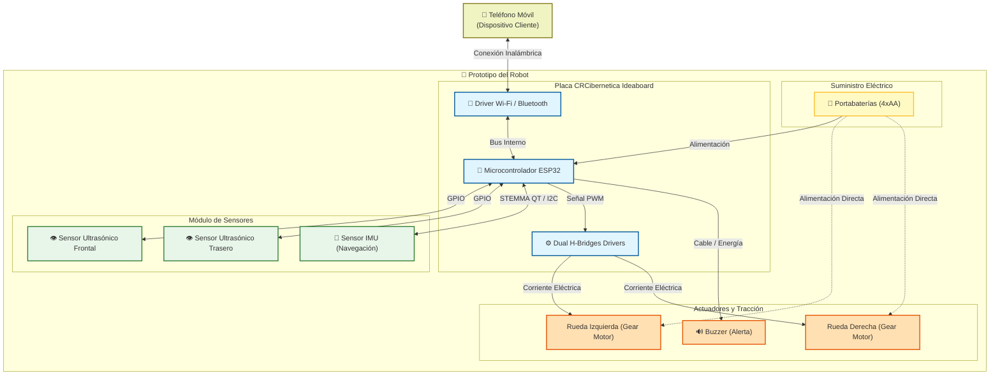
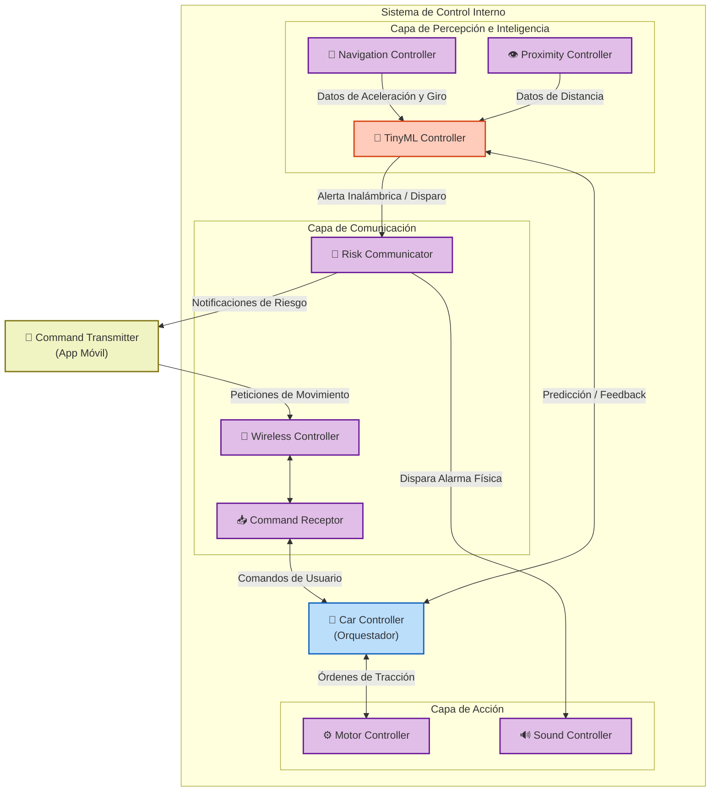

# Propuesta Inicial de Sistema Empotrado

[◀ Volver al Índice Principal](./README.md)

Este documento contiene la propuesta teórica inicial para el diseño y planeamiento del robot móvil controlado a distancia.

---

## 3. Posibles componentes a utilizar

Para el desarrollo del prototipo se requerirán los siguientes componentes principales de hardware, desglosados con sus respectivos subcomponentes:

**Componentes Requeridos (Base del Prototipo y Asistencia Inteligente):**

- **Placa de desarrollo CRCibernetica Ideaboard**: Funciona como el núcleo del sistema, consolidando:  
  - **Microcontrolador:** Módulo **ESP32-WROOM-32E**, el cual está construido sobre la serie de SoC ESP32 e integra un microprocesador **Xtensa dual-core 32-bit LX6**. Opera a 240MHz y cuenta con 520KB de SRAM y 8MB de FLASH, recursos ideales para ejecutar *TinyML* localmente.  
  - **Conectividad Inalámbrica:** Soporte de red nativo mediante los protocolos **WIFI 802.11b/g/n** y **Bluetooth V4.2 BR/EDR y Bluetooth LE** integrados en el chip.  
  - **Controladores de Motores:** La placa incorpora internamente **Dual H-Bridges for motor control** (puentes H duales) con capacidad de entregar hasta 800mA por cada motor.  
- **Sistema de Movimiento:** Plataforma física completa del robot. Se utilizará el kit **4WD Smart Robot Car Chassis** disponible en el laboratorio del curso, configurado para operar con tracción en 2 ruedas traseras (2WD efectivo), dejando las 2 ruedas delanteras libres como soporte direccional. Sus componentes incluyen:
  - Estructura: Placas acrílicas de doble nivel con tornillería de montaje.
  - Tracción principal: **2 x Gear Motor** (motores de engranajes) acoplados a llantas en la parte trasera, controlados directamente por los **Dual H-Bridges** integrados en el IdeaBoard.
  - Apoyo direccional: **2 x ruedas delanteras libres** instaladas sin motores conectados para proveer estabilidad al chasis.
- **Sensores:** Elementos provistos en el kit del curso para alimentar el modelo de IA:  
  - **Detección de distancia (2 x HCSR04 Ultrasonic Sensor):** Son sensores ultrasónicos capaces de medir distancias de forma continua mediante el reflejo de pulsos de sonido. Operan exclusivamente a través de pines **GPIO digitales**: un pin de salida (**TRIG**) recibe un pulso de 10 µs para disparar la ráfaga ultrasónica, y un pin de entrada (**ECHO**) permanece en HIGH durante el tiempo que tarda el sonido en rebotar contra el obstáculo y regresar. La distancia se calcula midiendo la duración de ese pulso con un temporizador. Se utilizarán en pares: uno montado en la parte frontal y otro en la parte trasera del chasis, consumiendo un total de 4 pines GPIO del IdeaBoard (TRIG_F, ECHO_F, TRIG_R, ECHO_R).
  - **Medición inercial (1 x Adafruit LSM6DS3TR-C IMU 6-DoF):** Es un módulo de percepción avanzado que funciona combinando un acelerómetro y un giroscopio de 3 ejes. Su uso en el sistema es monitorear los cambios en la aceleración lineal y registrar los giros o inclinaciones del chasis en el espacio 3D, proveyendo los datos de movimiento que el modelo de TinyML necesita para evaluar la conducción del usuario.  
  - **Conexión I2C (1 x Cable STEMMA QT / Qwiic):** Cable de interconexión rápida de 4 hilos. Su uso es enlazar exclusivamente el puerto Qwiic de la placa Ideaboard con el conector Qwiic del sensor IMU, transportando de forma simultánea la alimentación de energía y los datos del bus I2C sin necesidad de soldaduras.
- **Actuadores de Alerta:**  
  - Alarma Acústica: **1 x Buzzer** para emitir advertencias acústicas recomendadas por la IA ante riesgo de colisión.  
- **Alimentación:**  
  - Suministro de energía: **1x (4xAA) Battery Holder**. El chasis ya incluye este portabaterías para garantizar voltaje continuo y portátil.

**Componentes Opcionales y de Repuesto (Del kit del curso):**

Aprovechando la disponibilidad del kit de la clase, se contemplan estas piezas oficiales para mejoras o emergencias:

- **Electrónica Pasiva y Cableado:** Se contemplan resistencias (útiles para implementar pull-ups externos que estabilicen el voltaje si se añaden otros sensores I2C al bus) y cables para distribución de energía (como los cables rojos y negros de 15 cm provistos en el chasis o jumper wires estándar), necesarios para interconectar los voltajes y las tierras de los pines analógicos y digitales.  
- **Motores de Repuesto:** Los **2 x Micro Gearmotor** provistos en el kit de la clase quedarán como repuestos de seguridad en caso de fallo de los *Gear Motor* principales del chasis.  
- **Teleoperación Alternativa:** **1 x IR Receiver Diode** y **1 x IR Remote** para implementar control manual por infrarrojos como respaldo.  
- **Exploración Perimetral:** **1 x Microservo** para crear una base giratoria para el sensor ultrasónico, ampliando el escaneo frontal.  
- **Odometría y Seguimiento:** **2 x Track Sensor Module** y **1 x Rotary Sensor** para añadir funcionalidades de seguidor de línea o medición precisa de rotación de las ruedas.  
- **Percepción Ambiental y Contacto:** **1 x DHT11 Temperature / Humidity Sensor**, **1 x Adafruit Right Angle VEML770 Lux Sensor** y **2 x Touch Sensors** para dotar al robot de reacción ante colisiones físicas o sumar métricas de clima/iluminación al entorno.

---

## 4. Posibles tecnologías a utilizar

Para el desarrollo, control y gestión del proyecto se implementarán las siguientes tecnologías, protocolos y buenas prácticas:

- **Inteligencia Artificial para microcontroladores (Edge AI):** Se utilizarán frameworks de TinyML dejando abierta la opción de implementar TensorFlow Lite for Microcontrollers, o PyTorch mediante soluciones optimizadas para microcontroladores como ExecuTorch, o PyTorch Mobile. Estos frameworks permitirán entrenar e inferir modelos de aprendizaje automático directamente en el hardware. Esto habilitará el procesamiento local de las lecturas de los sensores para generar recomendaciones y alertas de navegación, sin depender del procesamiento en la nube.
- **Protocolos de Comunicación Inalámbrica:** Para el control remoto a través del dispositivo móvil utilizará los protocolos Wi-Fi (802.11b/g/n) o Bluetooth (V4.2 BR/EDR y BLE), aprovechando que el módulo ESP32-WROOM-32E de la placa IdeaBoard cuenta con soporte nativo para estas tecnologías.  
  - **Dabble**: Consiste en una aplicación móvil y una librería de C++ llamada DabbleESP32, la cual es totalmente. Esta librería expone un módulo de "GamePad" que convierte la pantalla del celular en un control con joystick analógico y botones digitales, ideal para gestionar la tracción de los motores de forma inmediata.  
- **Protocolos de Comunicación Local (Buses de Datos):**  
  - Uso de buses seriales síncronos como I2C o SPI, para interconectar sensores avanzados de forma eficiente. Específicamente, se utilizarán conectores STEMMA QT / Qwiic para los 2 sensores ultrasónicos, empleando I2C o SPI para tener comunicación directa entre estos dos dispositivos aprendices (esclavos) y la placa central.  
  - **UART** para la depuración por consola (*debug*) y comunicación asíncrona.  
  - **Modulación por Ancho de Pulsos (PWM)** para el control analógico preciso de la velocidad y dirección de los motores DC de las ruedas.  
- **Entornos y Lenguajes de Programación:** Se evaluará el desarrollo del código de aplicación (*Application Code*) en **C/C++** mediante el Arduino IDE o PlatformIO debido a su eficiencia en la gestión de recursos de memoria  y su compatibilidad estándar con TinyML. De forma complementaria, se contempla el uso de **CircuitPython** para agilizar el prototipado y las pruebas de concepto iniciales.  
- **Simulación de Hardware:**
  - **Wokwi:** Se utilizará este simulador de electrónica online para realizar pruebas virtuales y prototipado rápido de los circuitos, conexiones del microcontrolador ESP32 y la lógica de sensores y actuadores antes de interactuar con el hardware físico. Wokwi fue seleccionado sobre SimulIDE por recomendación del profesor del curso, y porque ofrece soporte nativo para el microcontrolador ESP32 (incluyendo sus capacidades Wi-Fi y Bluetooth), el cual no es compatible con SimulIDE. Wokwi también incluye modelos simulados del HC-SR04, servomotores y otros componentes utilizados en el proyecto, lo que permite validar la lógica del sistema de forma más fiel al hardware real.
- **Gestión de Código y Calidad (Ingeniería de Software):**  
  - **Control de Versiones:** El ciclo de vida del software estará versionado en un repositorio de **GitHub**, utilizando un enfoque ágil mediante *releases* progresivos para cada fase del proyecto.  
  - **TDD**: el desarrollo del proyecto utilizará la metodología de desarrollo guiada por pruebas tanto en el hardware como en el software.  
    - **ArduinoUnit**: Se utilizará si se requiere un entorno de pruebas simple ejecutado directamente en la placa (on-board testing).  
    - **AUnit**: Se evaluará como alternativa a ArduinoUnit si se requieren características más modernas y la capacidad de realizar pruebas en el host.  
    - **Unity**: Se seleccionará como la opción principal y más robusta en caso de que el equipo decida utilizar **PlatformIO** como entorno de desarrollo.  
  - **Integración Continua (Opcional)**: Se implementará **Integración Continua (CI)** mediante GitHub Actions para automatizar las pruebas de software antes del despliegue en producción hacia el hardware físico.

---

## 5. Arquitectura del Sistema

La arquitectura del proyecto se divide conceptualmente en dos capas principales: **Hardware** y **Software**. A continuación, se detallan los componentes, sus responsabilidades y las interacciones entre ellos.

### 5.1. Arquitectura de Hardware

El hardware está estructurado alrededor del microcontrolador principal (ESP32), el cual actúa como el cerebro del sistema. Éste se encarga de la comunicación externa, el control de los actuadores y la lectura de los sensores.

#### 5.1.1. Diagrama de Conexiones Físicas

#### 5.1.2. Descripción de Componentes Físicos

- **Microcontrolador ESP32:** Es el núcleo del sistema. Se comunica con los *H-Bridge Drivers* mediante señales PWM para controlar la tracción (adelante, atrás, izquierda, derecha) de los motores, conectados a los pines del IdeaBoard.
- **Módulo de Comunicación (Wi-Fi/Bluetooth):** Adaptador integrado en el ESP32 que recibe las conexiones entrantes desde el teléfono móvil u otros dispositivos externos.
- **Sensores Ultrasónicos:** Conectados vía pines GPIO, envían constantemente al ESP32 datos sobre la distancia a la que se encuentran los obstáculos en las partes frontal y trasera del chasis.
- **Sensor IMU:** Conectado mediante el conector rápido STEMMA QT (interfaz I2C), provee al microcontrolador información en tiempo real sobre la navegación, aceleración e inclinación.
- **Fuente de Energía:** Un portabaterías de 4xAA suministra la energía necesaria para encender el ESP32 y alimentar directamente la fuerza de los motores a través de los puentes H.

---

### 5.2. Arquitectura de Software

La estructura del software sigue un enfoque modular, en el que un controlador central orquesta el flujo de información entre la lectura de datos, el análisis inteligente y la ejecución de comandos.

#### 5.2.1. Diagrama de Componentes Lógicos

#### 5.2.2. Descripción y Tecnologías de los Módulos Lógicos

- **Car Controller:** Es el módulo orquestador y corazón del sistema. Su labor principal es sincronizar la información y los eventos entre todos los módulos auxiliares.
- **Command Transmitter:** Aplicación cliente (en el celular del usuario) responsable de emitir las peticiones de movimiento.
  - *Tecnologías:* Aplicación móvil **Dabble** (específicamente el módulo de *GamePad*).
- **Wireless Controller:** Capa de abstracción que gestiona la conexión de red física. Permite intercambiar de forma transparente la tecnología subyacente entre Bluetooth o Wi-Fi.
  - *Tecnologías:* Protocolos de hardware nativos del ESP32: **Wi-Fi (802.11b/g/n)** o **Bluetooth (V4.2 BR/EDR y BLE)**.
- **Command Receptor:** Actúa como servidor interno. Se mantiene a la escucha de peticiones provenientes del *Command Transmitter* mediante el *Wireless Controller*. Es la única vía autorizada para comandar el movimiento del robot.
  - *Tecnologías:* Librería de C++ **DabbleESP32**, encargada de parsear los paquetes de control enviados desde la app.
- **Motor Controller:** Encapsula la lógica de tracción. Transforma las instrucciones de alto nivel (avanzar, retroceder, girar izquierda/derecha) en señales concretas para los motores.
  - *Tecnologías:* **PWM (Modulación por Ancho de Pulsos)** usando la API nativa de control de motores del ESP32 para gestionar los puentes H (*Dual H-Bridges*).
- **Navigation Controller & Proximity Controller:** Módulos encargados de limpiar y procesar los datos crudos provenientes del sensor IMU y los sensores ultrasónicos respectivamente. Envían datos procesados al *TinyML Controller*.
  - *Tecnologías:* **I2C** a través del conector STEMMA QT / Qwiic para la comunicación directa con la IMU (Adafruit LSM6DS3). Para los sensores ultrasónicos HC-SR04, se utilizan pines **GPIO digitales** directamente: la señal TRIG se envía como salida digital y la duración del pulso ECHO se mide mediante temporizador para calcular la distancia al obstáculo.
- **TinyML Controller:** El cerebro analítico. Recibe del *Navigation Controller* y del *Proximity Controller* los datos procesados, ejecuta el modelo de inferencia en tiempo real, devuelve retroalimentación al *Car Controller* y comunica las alertas al *Risk Communicator*.
  - *Tecnologías:* Frameworks de Edge AI como **TensorFlow Lite for Microcontrollers**, **ExecuTorch** o **PyTorch Mobile**, ejecutando inferencia sobre modelos ligeros en memoria local.
- **Sound Controller:** Se encarga de activar la alarma acústica (Buzzer) desde el hardware del robot cuando el *Risk Communicator* le indica que el umbral de riesgo ha sido superado.
  - *Tecnologías:* Manejo directo de pines digitales **GPIO** o **PWM** en C++ para generar tonos de alerta.
- **Risk Communicator:** Gestor de notificaciones de seguridad. Recibe las alertas del *TinyML Controller* y dispara la alarma auditiva local a través del *Sound Controller*. Además, envía notificaciones de riesgo de vuelta al *Command Transmitter* (interfaz del usuario).

---

### 5.3. Mapeo entre Módulos Lógicos y Componentes Físicos

Para comprender cómo el software interactúa con el mundo físico, la siguiente tabla mapea qué componente de hardware específico es operado, controlado o leído por cada módulo de software:

| Módulo Lógico (Software) | Componente Físico (Hardware) | Función / Tipo de Interacción |
| :--- | :--- | :--- |
| **Car Controller** | Microcontrolador ESP32 | Unidad de procesamiento central (CPU/RAM). Orquesta el sistema. |
| **Command Transmitter** | Teléfono Móvil | Interfaz de control en manos del usuario final. |
| **Wireless Controller**   **Command Receptor** | Driver Wi-Fi / Bluetooth (ESP32) | Recepción de las peticiones de movimiento a través de la antena. |
| **Motor Controller** | Dual H-Bridges Drivers   Gear Motors (Izq/Der) | Traducción de lógica de movimiento a señales eléctricas de tracción. |
| **Navigation Controller** | Sensor IMU (Adafruit) | Adquisición de datos de inercia y giro por bus I2C. |
| **Proximity Controller** | Sensores Ultrasónicos (HCSR04) | Adquisición de datos de distancia midiendo rebotes de sonido por GPIO. |
| **TinyML Controller** | Microcontrolador ESP32 | Cómputo de la red neuronal sobre los núcleos Xtensa del microcontrolador. |
| **Sound Controller** | Buzzer | Conversión de señal digital a alerta sonora física. |
| **Risk Communicator** | Driver Wi-Fi / Bluetooth (ESP32) | Transmisión de notificaciones de riesgo de vuelta al celular. |

---
[◀ Volver al Índice Principal](./README.md)
